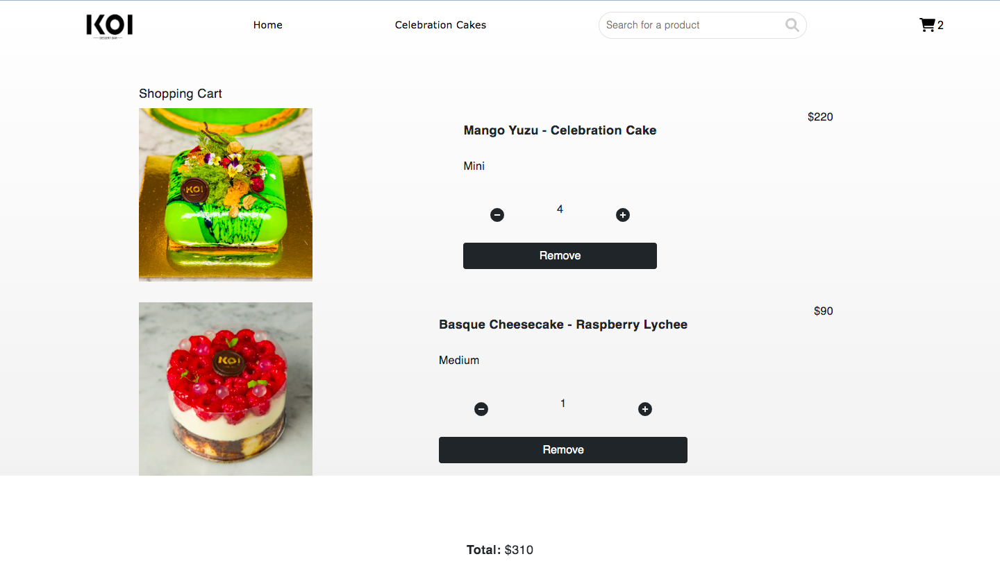

# KOI E-Commerce WebStore (React)

An e-commerce website built using React, Firestore and Bootstrap components. Featuring a design based on the [KOI Desert Bar](https://cakes.koidessertbar.com.au/) webstore.

### [Live Project](https://amx3.github.io/E-Commerce-React-Application/)

## Table of Contents

-   [ Screenshots ](#screenshots)
-   [Start-Up Instructions](#instructions)
-   [ Goals ](#goal)
-   [MVP](#mvp)
-   [Thought Process & Challenges Faced](#thought-process)
-   [Future Implementations](#future-implementations)
-   [Resources Used](#resources-used)

## Screenshots

**Carousel**

**Products**

**Modal**

**Cart Page**

## Instructions

In the project directory, you can run:

`npm start`

Runs the app in the development mode.
Open http://localhost:3000 to view it in the browser.

The page will reload if you make edits.
You will also see any lint errors in the console.

## Goals

-   To create an E-commerce site based on the MVP
-   Storing and retrieving data from FireStore using CRUD (Create, Read, Update, Delete Data)
-   Breakdown of store into components and containers
-   Usage of useEffect, useState and useContext React hooks and React Router

## MVP:

2 pages:

**Home Page:** Carousel of featured products + Grid of products
**Product Page (with id parameter):** Similar to a product page on another site, allows you to add to cart and select product variants

All products should be stored in Firestore, you should store the following information:

-   quantity
-   variants (could be colors, sizes, etc)
-   price per unit
-   name
-   image url
-   favourited or not (boolean)

**All data should be stored in Firestore and fetched by the frontend, there should be NO static product data in the react application**

## Bonus:

-   Using Firestore and React, create a cart system.
-   Add logic to prevent users from adding items to cart that are no longer in stock.
-   You will have to check the current cart and the product quantity

Cart page should have the following:

-   List of products in cart
-   Ability to change quantity of products in cart
-   Ability to remove items from cart

Make sure you site is scope to one category of products

## Thought Process

1. Created 3 containers:
    - Home Page - Carousel
    - Product Page - Products grid. When selecting on a product, a modal will pop up. Details such as name, price, size and quantity options are displayed.
    - Cart Page - Displaying a list of items in cart with individual item price and total price.
2. Created 2 global context: Search Context and CartContext

**Challenges Faced and Addressed**

The most difficult aspect of this project was coming up with the logic for the cart system, which would be held in a collection distinct from the products on FireStore. It would need to trigger changes in both collections anytime a product was (attempted to) be added, updated or removed from the cart.

**Cart Logic using States & CRUD**

1. To track changes to number, price, size, and the selected product, several state variables were constructed. Using a switch statement, the displayed price will change depending on the size selected by the user.

2. When using CRUD, the cart state is verified for an existing ID of the selected product when clicking the add to cart button.

    - If an ID is found, the previous quantity is replaced with the new quantity.
    - If the ID does not exist, a new record is created in our database for the selected product.

3. On the cart page, the user can change the quantity of a product or remove it.

4. Cart icon displays how many items are present within the cart on each page.

## Future Implementations

-   Implementation of item stock
-   Payment/ Checkout System

## Resources Used

-   [Bootstrap Carousel](https://getbootstrap.com/docs/4.0/components/carousel/)
-   [KOI Desert Bar](https://cakes.koidessertbar.com.au/)
-   [Stack Overflow](https://stackoverflow.com/questions/49150917/update-fields-in-nested-objects-in-firestore-documents)
